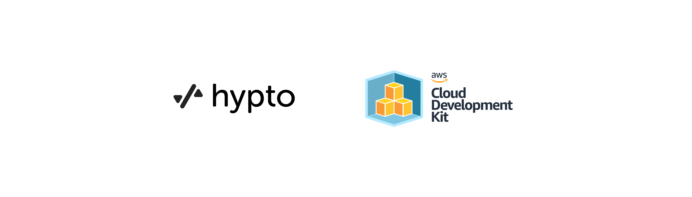

# Server Infrastructure



## Overview

**Server Infrastructure** using AWS and CDK.

AWS CDK Infrastructure package that creates:
1) Network Layer - Multi-AZ VPC with 3 subnets (1 public and 2 private-isolated)
2) Data Layer - Postgres Aurora database cluster and a Redis elasticache cluster
3) Service Layer - Fargate Service in an ECS cluster backed by an Application Load Balancer
4) CICD Layer - CodePipeline with 4 stages and a manual intervention.
5) Scripts - Scripts that assist in deploying and destroying

## File organization

The infra sources are organized into the following files:

- [package.json](package.json): Package dependencies for npm
- [network-layer.ts](lib/network-layer.ts): Construct to create a multi-AZ VPC with 1 public and 2 private isolated subnets.
- [data-layer.ts](lib/data-layer.ts): Construct to create a postgres aurora database cluster and a redis elasticache cluster.
- [ec2-service-layer.ts](lib/service-layer/ec2-service-layer.ts): Construct to create an EC2 instance in an AutoScalingGroup fronted by an ApplicationLoadBalancer with a validated DNS certificate.
- [fargate-service-layer.ts](lib/service-layer/fargate-service-layer.ts): Construct to create an ECS cluster with an ApplicationLoadBalancedFargateService and a validated DNS certificate.
- [cicd-layer.ts](lib/deployment-layer.ts): Construct to create a CodePipeline with a Source, CodeBuild, ManualApproval and ECSDeploy stages.
- [stack.ts](bin/stack.ts): Stack that creates above 4 constructs in the right order.
- [init.sh](init.sh) Script to install node, cdk and npm dependencies
- [bootstrap.sh](init.sh) Script to bootstrap CDK in a certain account and region.
- [configure.sh](configure.sh) Script to configure parameters and secrets in AWS.
- [deploy.sh](configure.sh): Script to deploy the infrastructure in AWS
- [destroy.sh](destroy.sh): Script to destroy the infrastructure in AWS
- [teardown.sh](teardown.sh): Script to de-configure parameters, secrets and remove any remaining resources that CDK couldn't destroy.
- [cleanup.sh](cleanup.sh): Script to remove dependencies and clean up infrastructure workspace

## Set up your own AWS and deploy the resources from your macOS
<details>
  <summary>Install Homebrew</summary>

Download and install Homebrew:

  ```sh
  /bin/bash -c "$(curl -fsSL https://raw.githubusercontent.com/Homebrew/install/HEAD/install.sh)"
  ```
</details>

<details>
  <summary>Install nvm</summary>

Install latest version of nvm:

  ```sh
  brew install nvm
  ```
</details>
<details>
  <summary>Install any version of Node</summary>

Install latest version of node:

  ```sh
  nvm install node
  ```

or any specific version of node:

  ```sh
  nvm install 14.17.6
  ```
</details>
<details>
<summary>Configure AWS CLI</summary>

Follow the instructions from [AWS CDK Getting Started](https://docs.aws.amazon.com/cdk/latest/guide/getting_started.html#getting_started_prerequisites)
to configure your AWS account

</details>
<details>
<summary>Initialize and deploy</summary>

To install and initialize your infra package, if not already done:

  ```sh
  ./init.sh
  ```

To bootstrap your CDK project in your AWS account and region:
  ```sh
  ./bootstrap.sh
  ```

To configure parameters and secrets necessary in AWS:
  ```sh
  ./configure.sh
  ```

To perform the deployment of your infrastructure in AWS:
  ```sh
  ./deploy.sh
  ```
</details>

<details>
<summary>Destroy and clean-up</summary>
 To install and initialize your infra package, if not already done:

  ```sh
  ./init.sh
  ```

To destroy your complete infrastructure in AWS:

  ```sh
  ./destroy.sh
  ```

To de-configure and teardown params, secrets and remaining infra in AWS:
  ```sh
  ./teardown.sh
  ```

To cleanup the infra package:
  ```sh
  ./cleanup.sh
  ```
</details>